# 瑞吉外卖项目 Reggie Takeout Project
瑞吉外卖是一个web应用程序。它包含了一个用户点餐系统和一个后台管理系统来管理员工、菜品以及订单。  
The project is a takeout/delivery web application. It includes a client ordering system and a backstage management system of meals, orders and faculty members. 
## 技术选型 Technology Used
项目采用**Mysql**作为底层数据库并通过*主从复制*实现读写分离。为了优化在高并发情况下的查询效率， 项目使用**Redis**来缓存需要频繁查询的数据，从而让客户端不需要频繁发送请求查询数据库，而是直接通过缓存获取数据。项目后端的主要框架是**Spring Boot**和**Mybatis-Plus**，前端的主要框架是**Vue**。  
The project chooses **Mysql** as the underlying database and adopts *Replication* to separate reading and writing of data. It later utilizes **Redis** to optimize data queries by caching frequently queried data. 
The main backend frameworks of the project are **Spring Boot** and **Mybatis-Plus**, and the main frontend framework is **Vue**. 
## 后台管理系统展示 Backstage management system demo
后台管理系统让管理员可以对菜品进行增删改查的操作、跟进订单、管理员工。  
Backstage management system is for administrator(s) to manage employees, add, update or delete meals, and track orders. 
### 登录页面 Login page
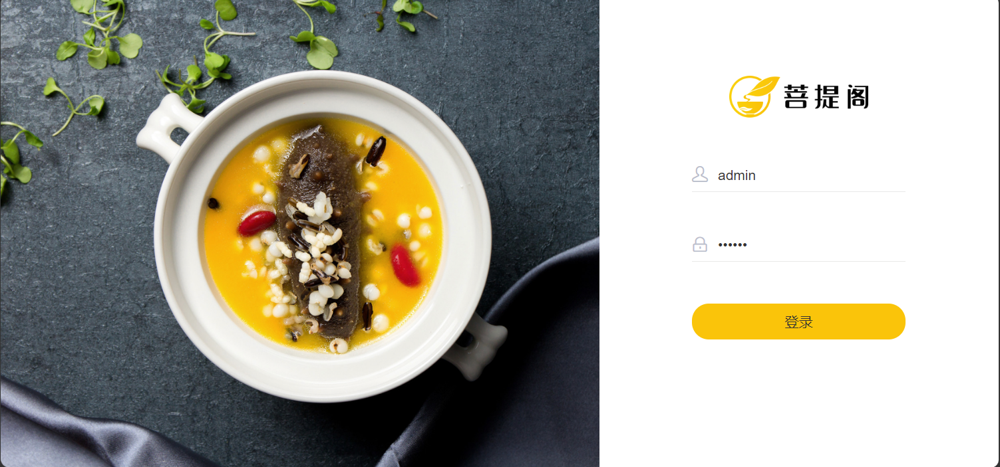
### 员工 Employees
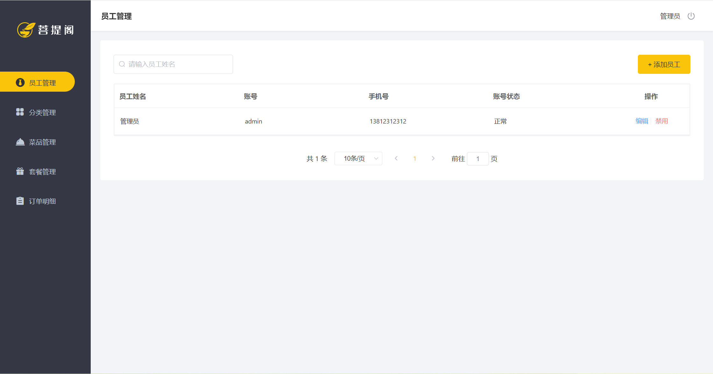
### 菜品分类 Categories of meals
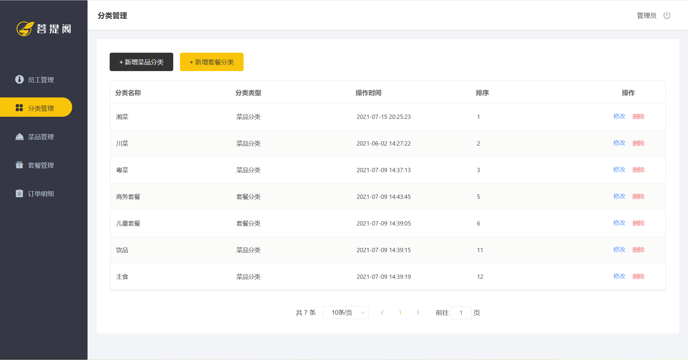
### 菜品 Meals
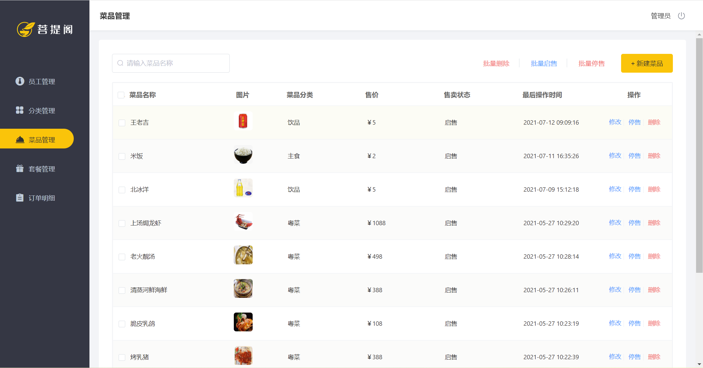
### 套餐 Set meals
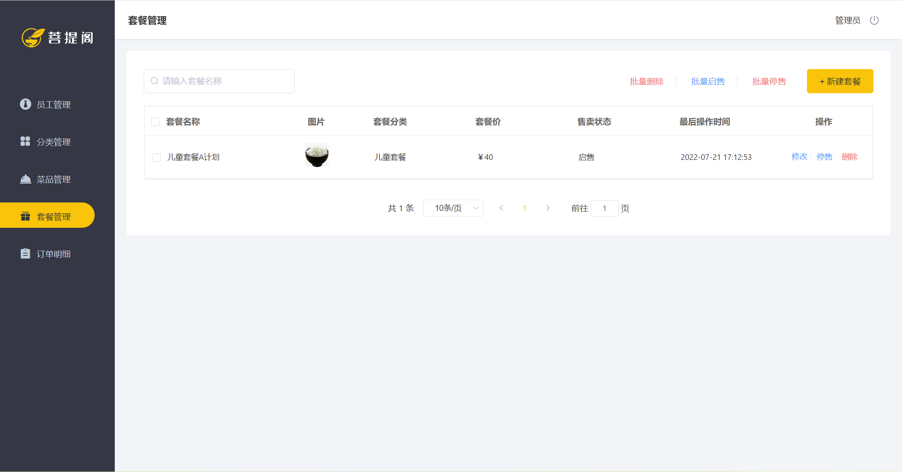
### 订单 Orders
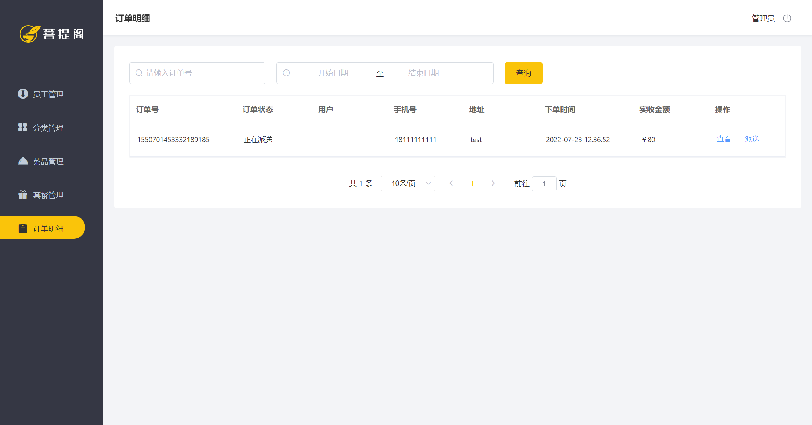

## 客户端点单系统 Client-side ordering system
客户端点单系统让用户可以管理地址、把菜品/套餐加入购物车并进行下单操作。  
Client-side ordering system is for clients to manage addresses, add meals to shopping cart and place orders. 
### 登录页面 Login page
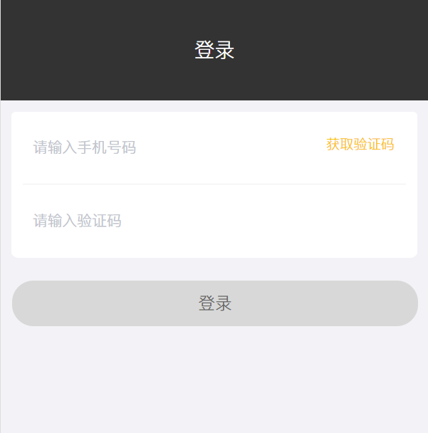
### 菜品展示 Display of meals
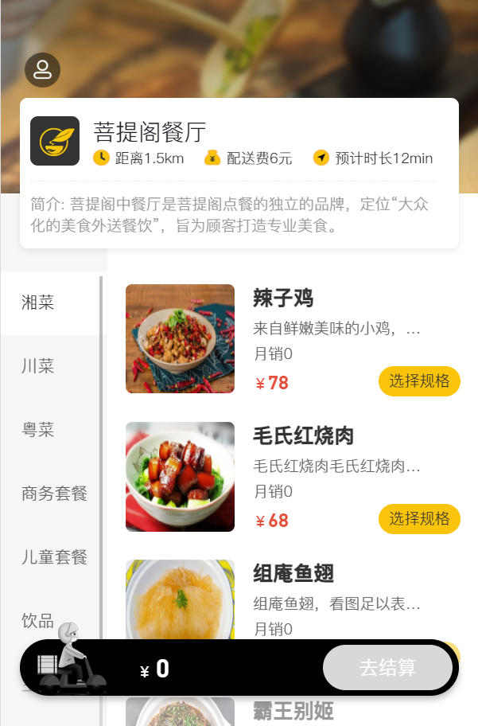
### 地址管理 Addresses
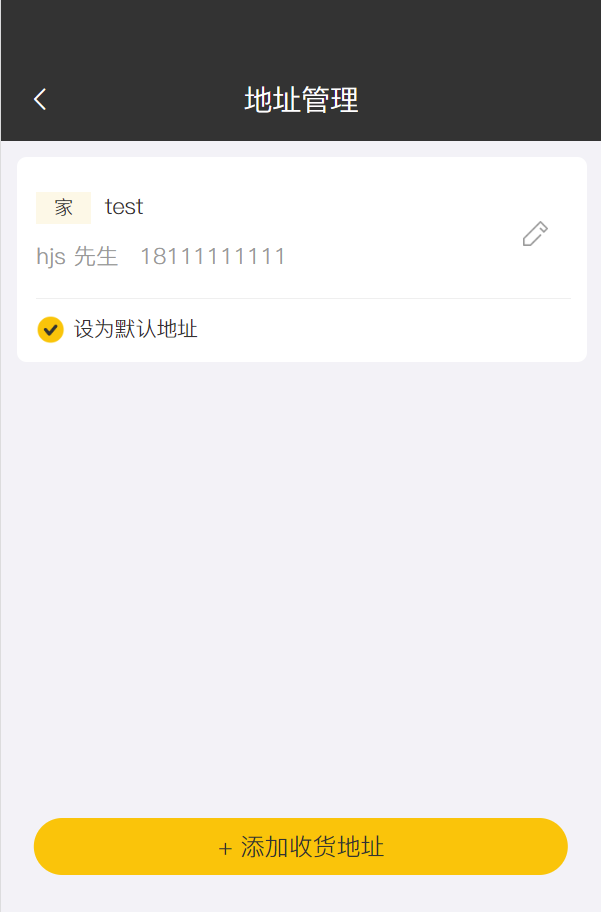
### 下单操作 Placing order
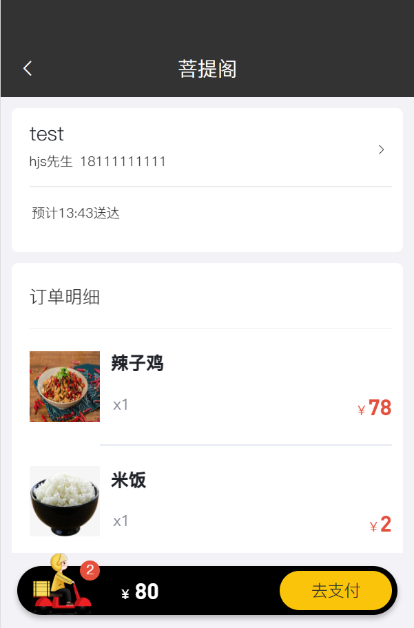
### 个人中心 Personal Space
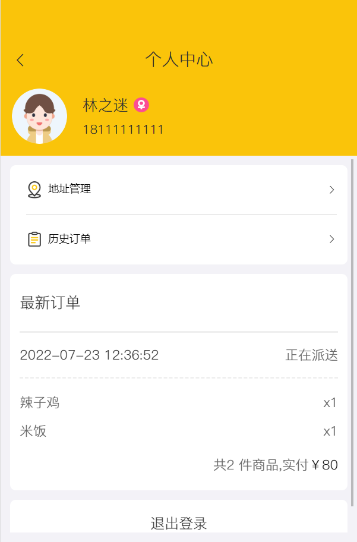